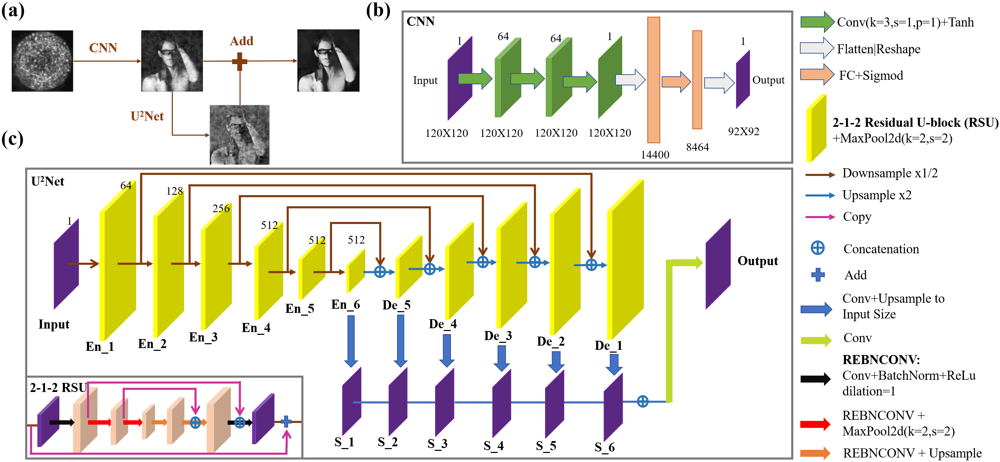
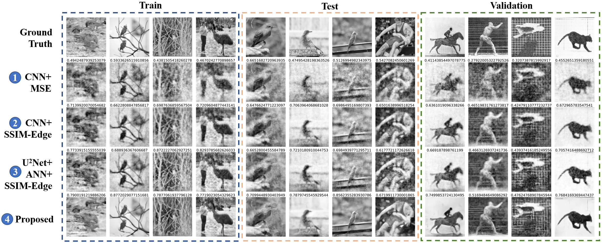
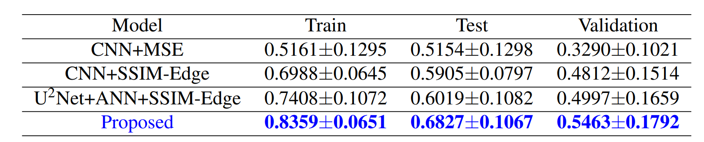

# SSIM-Edge-CAN-U2Net：Two Stage Residual Learning of Reconstructing Natural Scene Images Through Multimode Fiber

This repo contains the official implementation for the paper SSIM-Edge-CAN-U2Net：Two Stage Residual Learning of Reconstructing Natural Scene Images Through Multimode Fiber.

by Le Yang (2019212184@bupt.edu.cn).

## Abstract
The purpose of this article is to reconstruct the natural scene images from
speckles generated by multimode fiber (MMF). We use 50, 000 speckles generated by ImageNet dataset through MMF as experimental dataset. We firstly compare the different
effects of MSE, SSIM and SSIM-Edge loss functions. Experiment shows that SSIM-Edge
loss function performs better in many aspects. More experiments have shown that images
restored by a fully convolutional network (FCN) will be blurry, while images restored by
a convolutional network end with full connected layer (CAN) will be noisy. In order to
make MMF speckle imaging more clearer, we propose the SSIM-Edge-CAN-U2Net model
which is a two stages residual learning method. The experimental results show that the average value of the train dataset using SSIM as the evaluation index of the restored images
reach **0.8359**, which is **61.96%** higher than that CAN model using MSE as the loss function
of 0.5161, and **0.6827** (0.5154) on the test dataset, which is **32.46%** higher

## Network Architectures


## Reconstruct Images



## Running Experiments

### Environment

We use the code experiment environment conditions as shown in the following list:

- PyTorch 1.11.0
- Python 3.8 (ubuntu20.04)
- Cuda 11.3
- RTX 3090 (24GB) \* 1
- Jupyter Notebook or Lab

### Dependencies

You can install whatever python packages you find missing when running code, or just run the following command in the terminal.

```bash
pip install -r requirements.txt
pip install -r requirements.locked.txt
```

### Project structure

`train-com.ipynb` is the file for training the different model, `test-com.ipynb` is the file for testing the trained model which has been saved as `*.pkl`.

```bash
├── __init__.py
├── data   # download from google drive
│   └── Data_1m.h5  # mmf speckle and images
├── datasets  # encapsulation class for Datasets
│   ├── __init__.py
│   ├── identity.py
│   ├── normalize_0_1.py
│   ├── normalize__1_1.py
├── loss
│   ├── __init__.py  # class for ssim psnr edge loss
├── model  # pretrained model download from google drive
│   ├── cann-model.pkl
│   ├── epoch-ssim-175.pkl
│   ├── ssim-cann-model.pkl
│   └── u2net-ann-model.pkl
├── nets  # encapsulation class for CNN 、Unet、U2net and Swin-Transformer Networks
│   ├── __init__.py
│   ├── ann.py
│   ├── can.py
│   ├── cnn_u2net.py
│   ├── swin_transformer.py
│   ├── swin_transformer_unet.py
│   ├── u2net_ann.py
│   └── unet_ann.py
├── trains  # method of unified training model
│   ├── __init__.py
├── tests  # method of test trained model
│   ├── __init__.py
│   ├── can.py
│   ├── cnn_u2net.py
│   └── u2net_ann.py
├── utils  # method of display and evaluate results
│   ├── __init__.py
├── test-com.ipynb   # the entry point of test
├── train-com.ipynb  # the entry point of training
├── assets   # store results
│   └── t.jpg  # reconstruct images of train dataset
│   └── tt.jpg  # reconstruct images of test dataset
│   └── to.jpg  # reconstruct images of validation dataset
```

As for the training method of the model in another service and code, we will gradually move it to that repo.

## Data availability
Original data for 1 m MMF speckle at https://doi.org/10.5525/gla.researchdata.751. Download and place into `data` folder.

## Pretrained Checkpoints
Link: https://drive.google.com/drive/folders/14aNid5iSMKFj9R_T-CY5-1omyewJ9dL2?usp=sharing

These checkpoint files should be placed in the correct folder in **Project Structure**. Download and place into `model` folder.

## Acknowledgement

This repo partially use U2net model in [U2Net](https://github.com/xuebinqin/U-2-Net) repo and Unet mode in [CycleGAN-and-pix2pix](https://github.com/junyanz/pytorch-CycleGAN-and-pix2pix) repo.

## References

If you find the code/idea useful for your research, please consider citing

```bib

```
